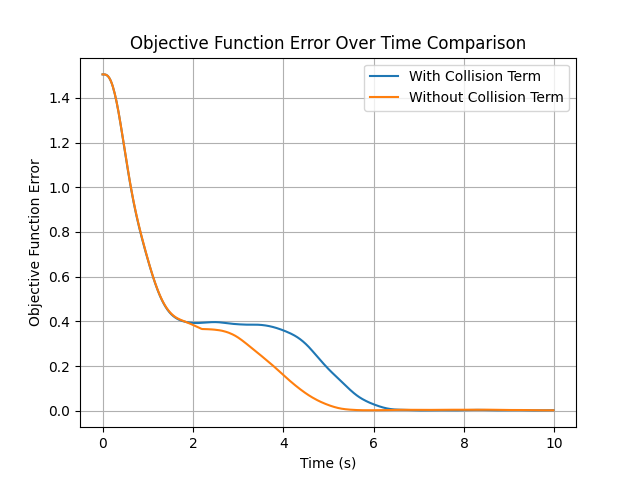

# Drone Multi-Control Algorithm for Formation Control
This project focuses on developing and optimizing formation control algorithms for multi-UAV systems. Using distance-based formation and gradient descent optimization, our approach enables drones to maintain safe distances, avoid collisions, and achieve precise formations. 
> [!NOTE]
> This is an optimization of the original `gym-pybullet-drones`/`examples`/`pid.py` repository , designed for compatibility with [PyBullet](https://github.com/bulletphysics/bullet3)

<table>
   <tr>
      <td>
         <p align="center">Classical Formation Control with Collision</p>
         
      </td>
      <td>
         <p align="center">Implemented Optimization with No Collision</p>
         
      </td>
   </tr>
</table>

## Dependencies 
This project tests its simulations on: `PyBullet` and uses `Python 3.10+`

For more information, please visit PyBullet's repository.
- [PyBullet](https://github.com/bulletphysics/bullet3)

## Virtual Environment Setup
1. Install necessary packages:
   ```bash
   pip install pybullet
   pip intall numpy
   pip install matplotlib
   ```
2. Important Notice
   
   If using Windows 11, you may need to install Microsoft's Visual Studio and disable Windows 11 SDK from the `Installation Details` section to get the simulator to work.

## How to Use the Code
1. Using a python terminal
   ```bash
   python pid_square_form.py
   ```
   Simulation Variables:
   - `H_STEP (the step-size for gradient descent)`: 0.15
   - `DEFAULT_DURATION_SEC`: 10 
   - `DEFAULT_NUM_DRONES`: 4

3. Output
   1. Initializes the PyBullet simulation environment and sets up drones at random starting positions.
      - Can use `np.random.seed(0)` to get both in the same initial positions
   2. Calculates desired inter-drone distances based on a target square formation.
   3. Runs the formation control algorithm using gradient descent to minimize formation error.
   4. Applies a repulsive force for collision avoidance when drones are closer than the safe distance for the first `run` function.
   5. Updates drone positions in real time using PID controllers to track gradient-based target points.
   6. Displays a live 3D simulation in the PyBullet viewer showing drones moving into formation.

## Example Plots
1. Gradient magnitude over time for each drone


2. Objective function error over time comparison


      

